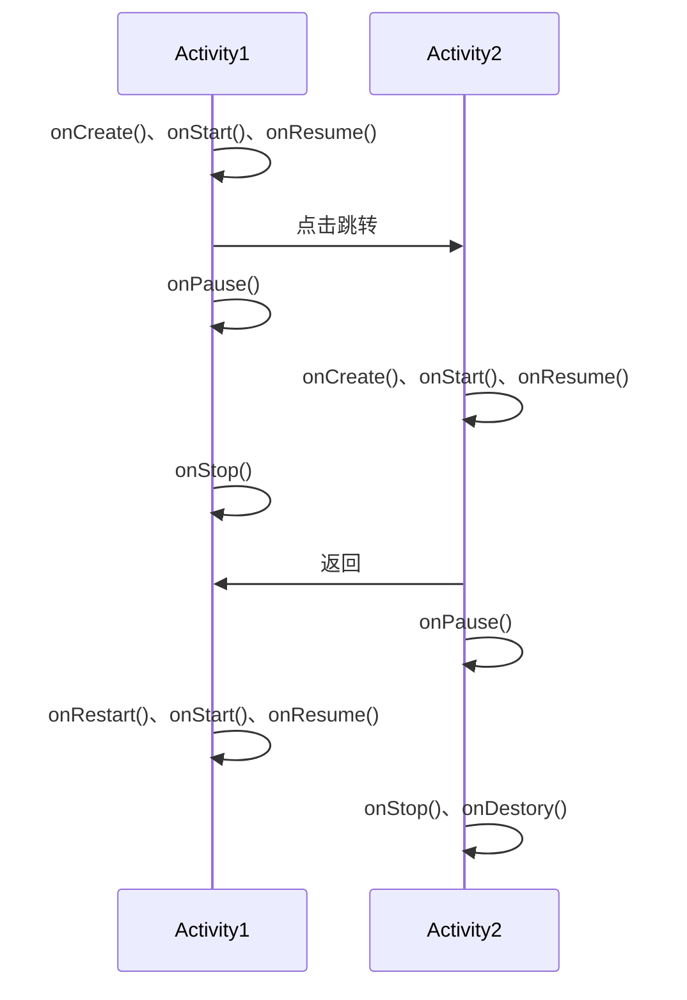
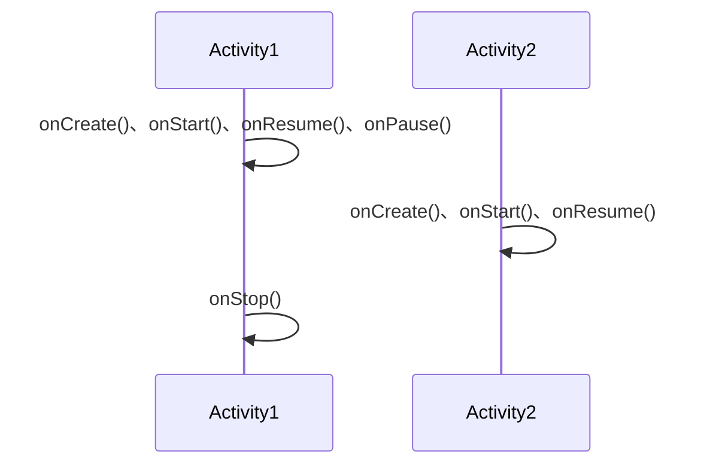
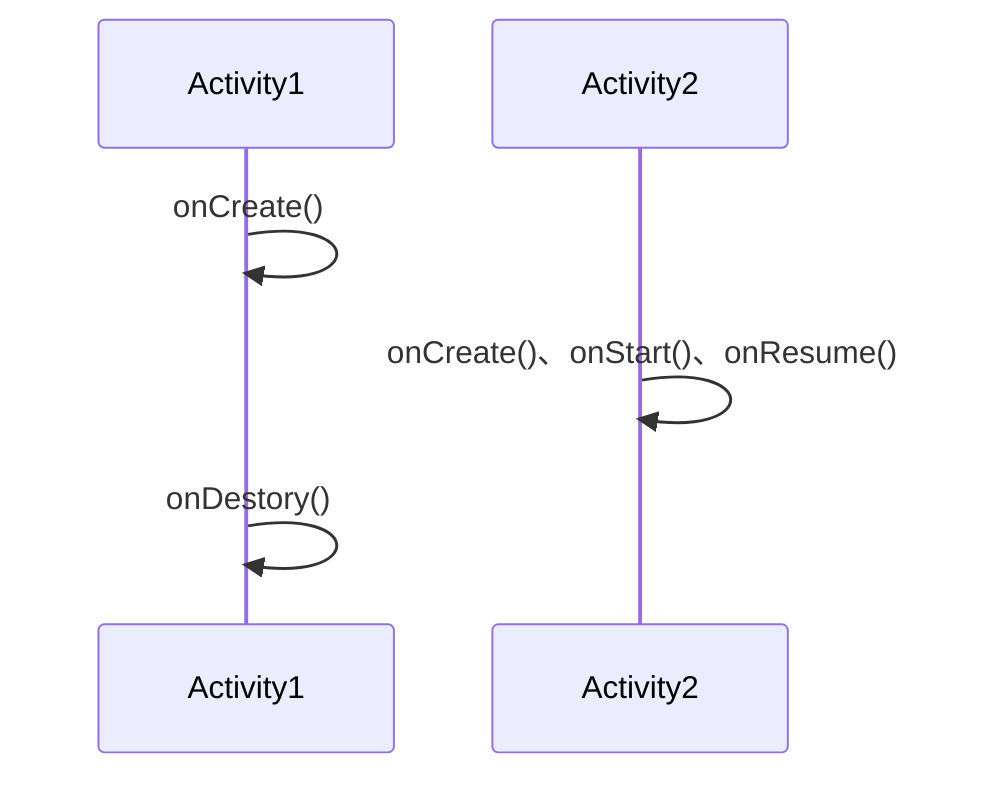
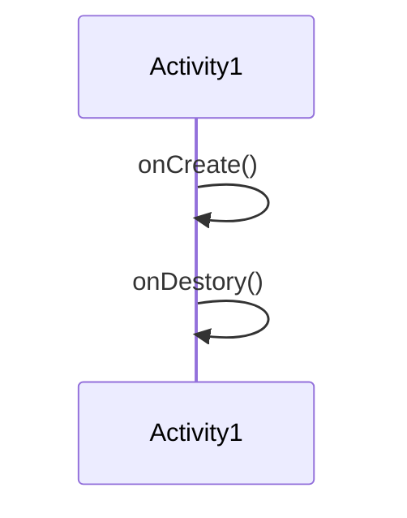
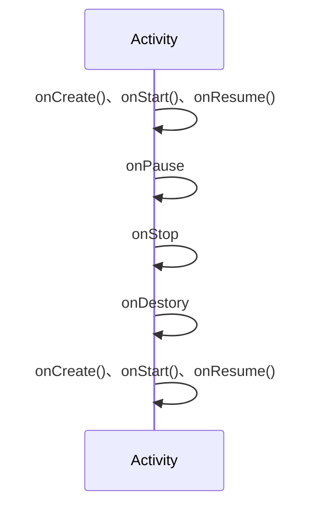
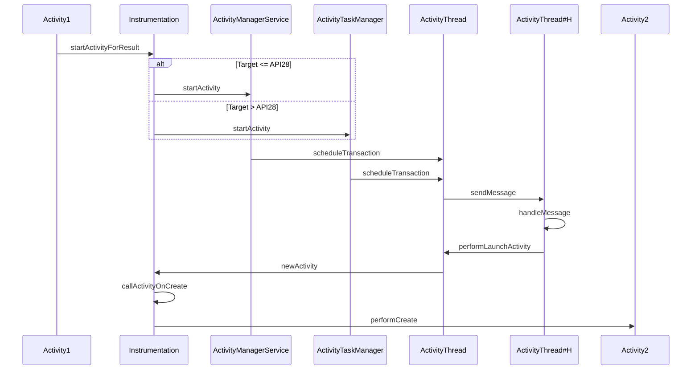

# Activity

## Lifecycle
### 点击跳转然后返回

### 在 onCreate() 中直接跳转

### 在 onCreate() 中先跳转后直接 finish()

### 直接在 onCreate() 中 finish()

### 旋转重建的生命周期
其实跟 finish() 后重新打开是一致的，走完了全部生命周期

## startActivity() 过程分析

