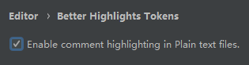

# Android-Study
用于学习 Android 进阶知识，计划一周干掉一个，能手搓就手搓一遍 :)

## 目录
### Android
- [x] [Handler](Handler)
  - Looper
  - MessageQueue
  - Message
  - Handler
- [x] [ThreadLocal](ThreadLocal)
- [x] [SparseArray](SparseArray)
- [ ] RecyclerView
- [ ] Glide
- [ ] OkHttp
- [ ] Retrofit
- [ ] LiveData
- [ ] ViewModel
- [ ] ARouter
- [ ] DataBinding
- [ ] ViewRootImpl
- [ ] 绘制
- [ ] 事件分发
- [ ] Coroutines
- [ ] Rxjava
- [ ] LeakCanary
- [ ] EventBus

## 注意事项
由于注释都是同一种颜色，不好写笔记，所以我使用了 Comments Highlighter 插件用于给不同的注释显示不同的颜色。

我的配置如下：
```
Comment
//#          FCAC00
///          FFD51D
注意          FF4302
```
在配置成功后你的注释应该是下面这种颜色(除了代码原有的字体颜色不一样外)：


因为 cpp 文件未导入进行编译，所以需要开启此选项才能在 cpp 里面看到特殊注释


