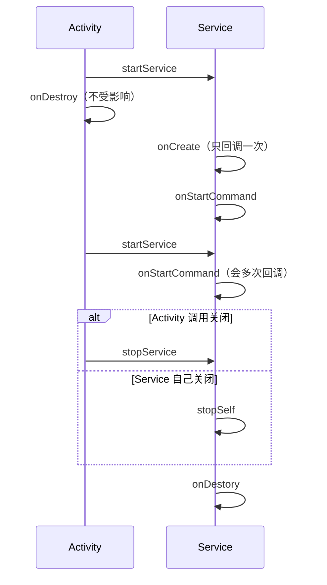
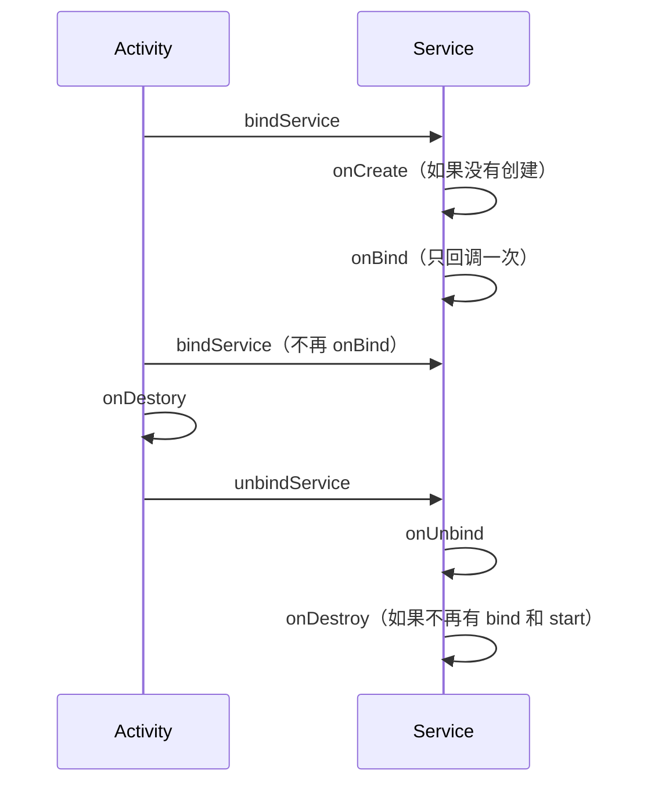

# Service

## 启动方式
## startService
startService 启动后生命周期与 Activity 分离

```mermaid
sequenceDiagram
Activity->>Service: startService
Activity->>Activity: onDestroy（不受影响）
Service->>Service: onCreate（只回调一次）
Service->>Service: onStartCommand
Activity->>Service: startService
Service->>Service: onStartCommand（会多次回调）
alt Activity 调用关闭
    Activity->>Service: stopService
else Service 自己关闭
    Service->>Service: stopSelf
end 
Service->>Service: onDestory
```

## bindService
bindService 启动后生命周期与 Activity 关联，在 Activity.onDestroy 时 unbind，

```mermaid
sequenceDiagram
Activity->>Service: bindService
Service->>Service: onCreate（如果没有创建）
Service->>Service: onBind（只回调一次）
Activity->>Service: bindService（不再 onBind）
Activity->>Activity: onDestory
Activity->>Service: unbindService
Service->>Service: onUnbind
Service->>Service: onDestroy（如果不再有 bind 和 start）
```